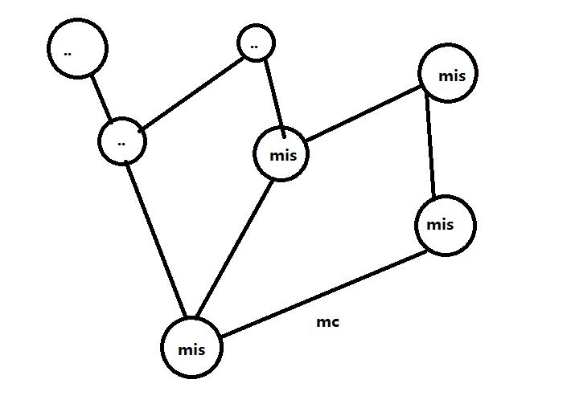

# timeyond
thinking across periods and spaces

## missing
    mis is short for missing
    a mis is the unit of timeyond, a mis means one thinking at some place at some time
    so mis has its basic attributes : site and date

## mis chain
    mc is the chain on two ms, it is a link
    a mis may have many mcs

